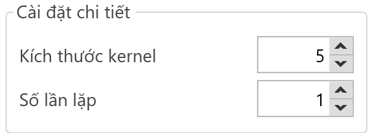

# Image Processing
Tập trung vào xử lý và phân tích các hình ảnh kỹ thuật số nhằm cải thiện chất lượng hình ảnh, trích xuất thông tin hoặc chuyển đổi hình ảnh thành các dạng khác để dễ dàng phân tích và sử dụng hơn.
## Hình Ảnh Minh Họa
## Cách Sử Dụng Phần Mềm

#### Bước 1 Thêm Công Cụ Vào Danh Sách :

     
#### Bước 2 Cài Đặt Tham Số :
-Lựa Chọn Nguồn Ảnh : 

     

-Thêm Xử Lý :

     

 Người dùng lựa chọn cách xử lý dựa theo yêu cầu của bài toán

    1. Smoothing  là một kỹ thuật trong xử lý ảnh dùng để giảm bớt nhiễu (noise) và làm mềm các chi tiết trong ảnh. Quá trình này thường được thực hiện bằng cách áp dụng một bộ lọc (filter) lên ảnh để làm mờ các chi tiết sắc nét và làm giảm sự biến động mạnh về độ sáng.

          

     Sau khi lựa chọn cài đặt chi tiết : Người dùng cần lựa chọn giá trị cài đặt
     ##### Ý Nghĩa Giá Trị Cài Đặt:

         

           - Bộ lọc Gaussian (Gaussian Filter): Sử dụng một bộ lọc Gaussian, trong đó các giá trị trong bộ lọc được xác định bởi hàm Gaussian. Bộ lọc này làm mờ ảnh theo một cách mượt mà hơn so với bộ lọc trung bình.

           - Bộ lọc Median (Median Filter): Thay thế giá trị của mỗi pixel bằng giá trị trung bình của các pixel lân cận. Bộ lọc này rất hiệu quả trong việc loại bỏ nhiễu muối tiêu (salt-and-pepper noise).

           - Bộ lọc Bilateral (Bilateral Filter): Làm mờ ảnh trong khi vẫn giữ lại các cạnh sắc nét. Bộ lọc này cân nhắc cả sự tương đồng về không gian và màu sắc khi làm mờ.

  2. Threadholding : là một kỹ thuật đơn giản nhưng rất hiệu quả trong xử lý ảnh, dùng để phân đoạn ảnh thành các vùng hoặc đối tượng riêng biệt dựa trên mức độ xám (gray level) của các pixel. Mục đích chính của thresholding là tạo ra một ảnh nhị phân (binary image) từ một ảnh xám (grayscale image), trong đó các pixel sẽ được gán một trong hai giá trị: 0 (đen) hoặc 255 (trắng), tùy thuộc vào giá trị ngưỡng (threshold) đã chọn.

         

     Sau khi lựa chọn cài đặt chi tiết : Người dùng cần lựa chọn giá trị cài đặt
     ##### Ý Nghĩa Giá Trị Cài Đặt:

          
   
    
           - Global Thresholding (Ngưỡng toàn cục):

    Một giá trị ngưỡng duy nhất được áp dụng cho toàn bộ ảnh.
    Các pixel có giá trị xám lớn hơn hoặc bằng ngưỡng sẽ được gán giá trị 255 (trắng), còn lại sẽ được gán giá trị 0 (đen).

           - Adaptive Thresholding (Ngưỡng thích ứng):

     Giá trị ngưỡng thay đổi theo vùng của ảnh, tùy thuộc vào tính chất cục bộ của vùng đó

           - Auto Thresholding:

    Tự động tìm giá trị ngưỡng tối ưu dựa trên histogram của ảnh.
    Phương pháp này cố gắng tìm giá trị ngưỡng sao cho tổng phương sai trong lớp của hai vùng (foreground và background) là nhỏ nhất.

          

    - Binary : Chuyển đổi ảnh thành ảnh nhị phân bằng kỹ thuật thresholding là một bước cơ bản nhưng rất quan trọng trong xử lý ảnh. Nó giúp đơn giản hóa ảnh, làm nổi bật các đặc trưng quan trọng và chuẩn bị cho các bước xử lý tiếp theo

    - BinaryInv : là một biến thể của kỹ thuật thresholding trong xử lý ảnh, được sử dụng để tạo ra một ảnh nhị phân nghịch đảo. Khi áp dụng BinaryInv, các pixel có giá trị xám lớn hơn hoặc bằng ngưỡng sẽ được gán giá trị 0 (đen), trong khi các pixel có giá trị xám nhỏ hơn ngưỡng sẽ được gán giá trị 255 (trắng). Điều này tạo ra một hiệu ứng nghịch đảo so với phương pháp thresholding nhị phân thông thường 

    - Trunc : là một phương pháp thresholding đặc biệt được sử dụng để giới hạn giá trị của các pixel trong ảnh. Khi áp dụng Trunc thresholding, các pixel có giá trị xám lớn hơn hoặc bằng giá trị ngưỡng (threshold) sẽ được gán bằng giá trị ngưỡng, trong khi các pixel có giá trị xám nhỏ hơn ngưỡng sẽ giữ nguyên giá trị gốc của chúng. Kết quả là ảnh sẽ có giá trị các pixel bị giới hạn tối đa bằng giá trị ngưỡng

    - Tozero : là một phương pháp thresholding trong xử lý ảnh, được sử dụng để làm nổi bật các pixel có giá trị lớn hơn một ngưỡng nhất định, trong khi các pixel có giá trị nhỏ hơn ngưỡng sẽ được gán giá trị 0. Phương pháp này giúp giữ lại các giá trị pixel quan trọng trong khi loại bỏ các pixel không quan trọng.

    - TozeroInv : là một biến thể của kỹ thuật thresholding trong xử lý ảnh. Khi áp dụng TozeroInv, các pixel có giá trị xám nhỏ hơn hoặc bằng giá trị ngưỡng sẽ giữ nguyên giá trị ban đầu, trong khi các pixel có giá trị xám lớn hơn ngưỡng sẽ được gán giá trị 0. Điều này tạo ra hiệu ứng nghịch đảo so với phương pháp thresholding Tozero

  

  - Ngưỡng phân cực : tạo ra  ngưỡng phân cực các pixel trong ảnh
  - Giá trị tối đa :  tạo ra giá trị tối đa giá trị pixel dùng để tính toán

  3. Erosion : là một kỹ thuật trong xử lý ảnh, đặc biệt trong lĩnh vực phân hình toán học (morphological image processing). Kỹ thuật này được sử dụng để làm mòn biên của các đối tượng trong ảnh nhị phân, thu nhỏ kích thước của các đối tượng và loại bỏ các điểm nhiễu nhỏ.

  

  

  Kích thước kenel : là kích thước ma trận errosion kenel , giúp loại bỏ biên và làm mờ đối tượng
  Số lần lặp : Phần mềm sẽ tự động thực hiện Errosion theo số lần được cài đặt

  4. Dilation : là một kỹ thuật mạnh mẽ trong xử lý ảnh, giúp mở rộng các đối tượng và lấp đầy các lỗ hổng nhỏ trong ảnh nhị phân. Phép giãn nở thường được sử dụng trong các ứng dụng như làm sạch nhiễu, kết nối các phần tử bị tách rời và chuẩn bị cho các bước xử lý tiếp theo. Bằng cách kết hợp dilation với erosion, chúng ta có thể thực hiện các phép toán phân hình phức tạp hơn để phân tích và nhận diện đối tượng trong ảnh một cách hiệu quả.

  Kích thức kenel :là kích thước ma trận Dilation kenel,giúp thêm các pixel biên để làm lớn các đối tượng
  Số lần lặp : Phần mềm sẽ tự động thực hiện Dilation theo số lần được cài đặt

